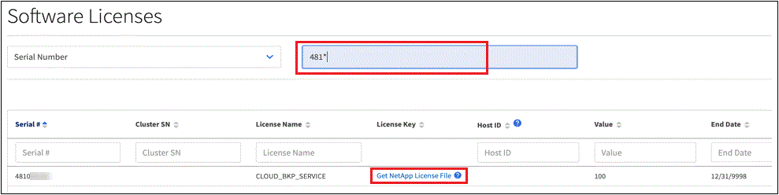

License information automatically displayed in digital wallet when the BlueXP account associated with the license is also an NetApp Support Site account and BlueXP has access to the internet. If your BlueXP account is not associated with your NSS account, you'll need to manually add a license. 

After you purchase a license from your NetApp sales representative, NetApp sends you an email with the serial number and additional licensing details. In the case where you do not see your licenses automatically, you'll need that serial number to obtain the respective license.

You can add the license in BlueXP either by entering the serial number and the associated NSS account, or by uploading the NetApp license file (NLF). You should obtain a NetApp license file to upload if BlueXP does not have internet access (private mode installations).

NOTE: If you want to enter the serial number, you first need to https://docs.netapp.com/us-en/bluexp-setup-admin/task-adding-nss-accounts.html[add your NetApp Support Site account to BlueXP^]. This is the NetApp Support Site account that's authorized to access the serial number.

The steps below show how to get the NetApp license file from the NetApp support site.

.Steps

. Find your BlueXP account ID:

.. In the upper right of the BlueXP console, select image:icon-settings-option.png[The settings icon which displays in the top right of the BlueXP web console.] > *Identity & Access Management*.
.. On the Organization page, look for your account ID and copy it. 
+
If there is no account ID listed and you just have an organization ID, then you'll need to copy the first eight characters of the organization ID and append it to _account-_
+
For example, let's say this is your organization ID:
+
ea10e1c6-80cc-4219-8e99-3c3e6b161ba5
+
Your account ID would be as follows: 
+
account-ea10e1c6

. Sign in to the https://mysupport.netapp.com[NetApp Support Site^] and select *Systems > Software Licenses*.

. Enter the serial number for your license.
+

. In the *License Key* column, select *Get NetApp License File*.

. Enter your BlueXP account ID (this is called a Tenant ID on the support site) and select *Submit* to download the license file.
+
image:../media/screenshot_cloud_backup_license_step2.gif[A screenshot that shows the get license dialog box where you enter your tenant ID and then select Submit to download the license file.]
